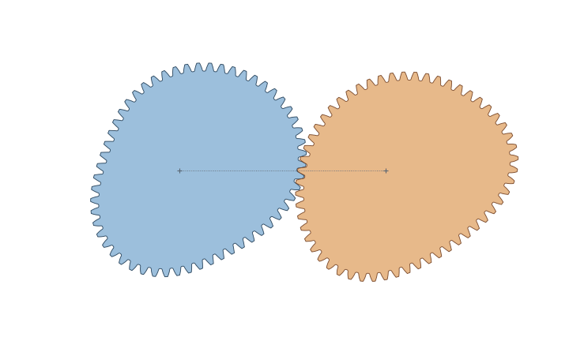

# ncgears

`ncgears` generates noncircular gear pairs from a transmission law or a
pitch-curve shape.

The generator creates 2D outlines, verifies the assembled pair for interference
and contact-motion error, and exports CSV, SVG, DXF, JSON, PNG, and animated GIF
files. It supports closed gears, finite open segments,
unequal ratios, and involute-rack or cycloidal-rack tooth families.
The complete application and geometry pipeline are implemented in Python;
Shapely/GEOS provides robust floating-point polygon operations.



> **Project status:** alpha. Generated geometry should be reviewed for the
> intended material, manufacturing process, load, speed, and tolerances.

## Install

```bash
pip install ncgears
```

PNG, animated GIF, and interactive Matplotlib previews are optional:

```bash
pip install "ncgears[plot]"
```

## Command line

Most functionality is available in the CLI:

```bash
ncgears "phi - 0.08*sin(2*phi)" --teeth 24 --module 1.5 \
  --name two_lobe --dxf two_lobe.dxf --render --gif --plot

ncgears "1 + 0.08*cos(2*phi)" --centrode --teeth 20 \
  --name centrode_two_lobe
```

Run `ncgears --help` for all commonly used options.

## Basic python usage

Describe the desired relationship between the drive angle `phi` and the driven
angle. Here the driven gear speeds up and slows down twice per revolution while
returning to the same 1:1 average ratio:

```python
import ncgears

pair = ncgears.generate(
    "phi - 0.08*sin(2*phi)",
    teeth=24,
    module=1.5,
    name="two_lobe",
)

print(pair.summary())
pair.export_dxf("two_lobe.dxf")
pair.export_svg("two_lobe.svg")
```

`module` and all exported coordinates use millimetres. The returned
`GearPair` also provides:

```python
pair.drive_outline           # (N, 2) NumPy array
pair.driven_outline          # centered on its own shaft
pair.placed_driven_outline   # translated into assembled position
pair.center_distance
pair.drive_teeth
pair.driven_teeth
pair.ratio
pair.maximum_transmission_error
pair.metadata                # complete verification report
pair.directory               # CSV and JSON source files
pair.render()                # pair.png; requires ncgears[plot]
pair.render_gif()            # pair.gif; follows the generated motion law
pair.plot()                  # interactive motion slider, zoom, and pan
```

Pass `plot=True` to `generate()` or `generate_from_centrode()` to open the
interactive plot as soon as generation finishes. The returned Matplotlib
figure can also be embedded or customized without opening a window:

```python
figure = pair.plot(show=False)
figure.suptitle("My mechanism")
```

The output directory defaults to `out/<name>/`. Each successful generation
contains `drive.csv`, `driven.csv`, `metadata.json`, and the sampled input.

## Start from a pitch curve

If the drive gear's pitch radius is easier to describe than its motion law, use
a centrode expression:

```python
pair = ncgears.generate_from_centrode(
    "1 + 0.08*cos(2*phi)",
    teeth=20,
    module=1.0,
    name="centrode_two_lobe",
)
```

The radius may use arbitrary units; ncgears scales its arc length to the
requested tooth count and module. By default it solves the center distance for
one mate revolution. A specific ratio can be selected with
`target_cycle_delta`. For example, a five-lobed 5:2 angular ratio uses:

```python
import math

pair = ncgears.generate_from_centrode(
    "1 + 0.05*cos(5*phi)",
    teeth=100,
    target_cycle_delta=5 * math.pi,
    profile="cycloidal",
    name="five_to_two",
)
```

## Closed and open designs

Closed gears require a smooth, strictly increasing motion whose cycle advance
produces an integer mate tooth count. A simple 2:1 pair is:

```python
pair = ncgears.generate("2*phi", teeth=20)  # 20 drive teeth, 10 driven teeth
```

Finite, non-repeating motion can be generated as an open segment:

```python
pair = ncgears.generate(
    "1.8*phi + 0.03*sin(phi)",
    open_=True,
    drive_end=2.4,
    teeth=12,
    name="finite_segment",
)
```


## What is verified

The Python engine uses swept rack-cutter solids and Shapely/GEOS regularized
polygon operations. A successful result includes checks for:

- simple, hub-connected gear bodies
- sampled whole-cycle solid interference
- contact motion recovered from the finished outlines
- sweep resolution, root radius, tip thickness, and centrode curvature
- sliding-velocity and undercut diagnostics

`metadata.json` records `geometry_backend: "shapely-geos"`, double-precision
construction, worker limit, cutter-pose count, and the maximum sweep step.
Independent involute gear sweeps and verification phases use a bounded thread
pool of at most eight workers; the dependent cycloidal master/mate sweeps
remain sequential. Floating-point Boolean error is normally far below the
error from discretizing cutter motion; increase `samples_per_radian` when a
design operates close to its tolerances.

These geometry checks are not load-rating or manufacturing certification.

## Development

```bash
python -m pip install -e ".[dev]"
python -m pytest
ruff check ncgears tests
python -m build
```

The GitHub Actions workflow tests Python 3.10–3.13, builds a platform-independent
ncgears wheel, and smoke-tests the installed wheel. Shapely supplies its GEOS
runtime through its own platform wheels.

## Method and prior work

The pitch-curve equations follow Uwe Bäsel,
["Determining the geometry of noncircular gears for given transmission
function"](https://arxiv.org/abs/1905.02642). Tooth geometry is constructed by
sweeping a parameterized rack cutter rather than assembling only locally convex
branches. The silhouette-fitting problem addressed by Xu et al.,
["Computational Design and Optimization of Non-Circular
Gears"](https://doi.org/10.1111/cgf.13939), is complementary: a fitted
transmission derivative or polar centrode can be passed into ncgears.

Contributions and reproducible test cases are welcome through the
[issue tracker](https://github.com/kylebme/ncgears/issues).

## Project context

This project contains entirely AI generated code. This project has been my personal benchmark for 
determining how capable coding models are for over a year. Models have saturated this benchmark, 
so I'm releasing the project as an alpha.

## License

ncgears is distributed under the Apache License 2.0.
